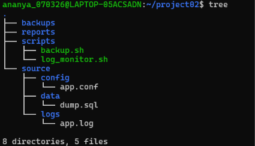
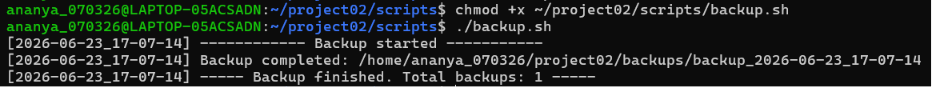
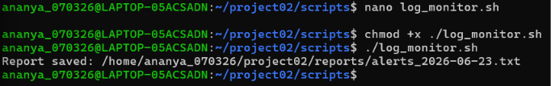
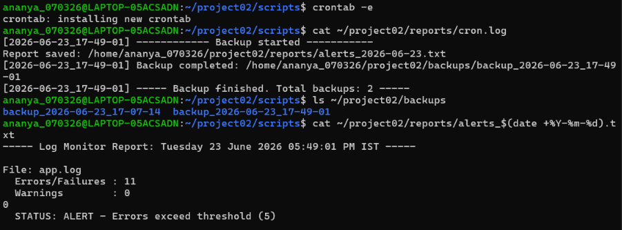
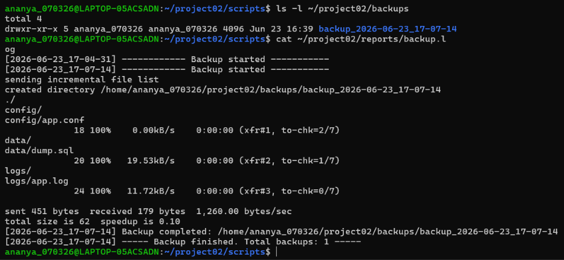
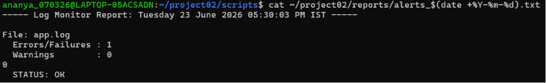
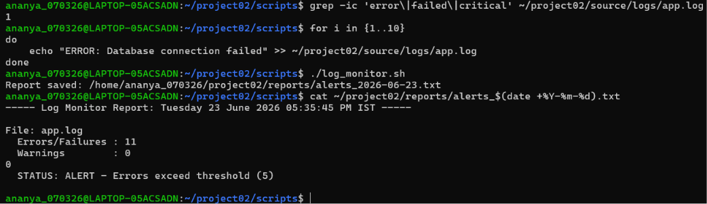
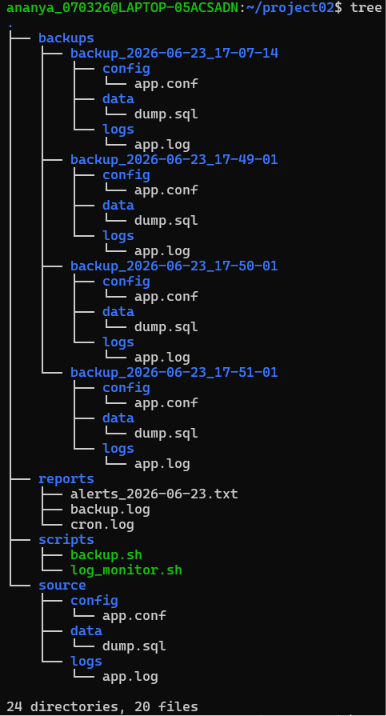

# Automated Backup and Log Monitoring System
This project demonstrates the implementation of an automated backup and log monitoring solution using Bash scripting, rsync, cron, and systemd on Ubuntu WSL.

**The system performs:**

- *Automated timestamped backups*
- *Backup rotation management*
- *Log analysis and anomaly detection*
- *Threshold-based alert generation*
- *Scheduled execution using cron*
- *Service management using systemd*

## Technologies Used
- Ubuntu WSL
- Bash Scripting
- rsync
- cron
- systemd
- mailutils

## Project Structure

  

## Features

### Automated Backup System
- Creates timestamped backups
- Uses rsync for file synchronization
- Excludes temporary files
- Monitors disk usage
- Maintains only the latest seven backups

### Log Monitoring System
- Scans application logs
- Detects errors, failures, and critical events
- Generates daily reports
- Triggers alerts when thresholds are exceeded
- Supports optional email notifications

### Automation
- Daily backup execution using cron
- Hourly log monitoring using cron
- systemd service integration

## Validation Performed

- Manual script execution
<h3 align="center">backup.sh execution</h3>

  

<h3 align="center">log_monitor.sh execution</h3>

  

- Automatic cron execution

  

- Backup creation verification

  

- Alert generation verification

  

  

## Limitations
Email alert delivery requires an SMTP relay or mail server configuration. The functionality was implemented and tested in Ubuntu WSL where external email delivery was not configured.

<h3 align="center">Implementation Evidence</h3>
The screenshot below demonstrates the successful implementation of the automated backup and log monitoring system. It highlights the organized project directory, timestamped backup snapshots, generated reports, and automation scripts.

  

## Learning Outcomes
- Linux system administration
- Shell scripting
- File management and automation
- Log analysis
- Job scheduling with cron
- Service management with systemd
- Monitoring and alerting concepts
